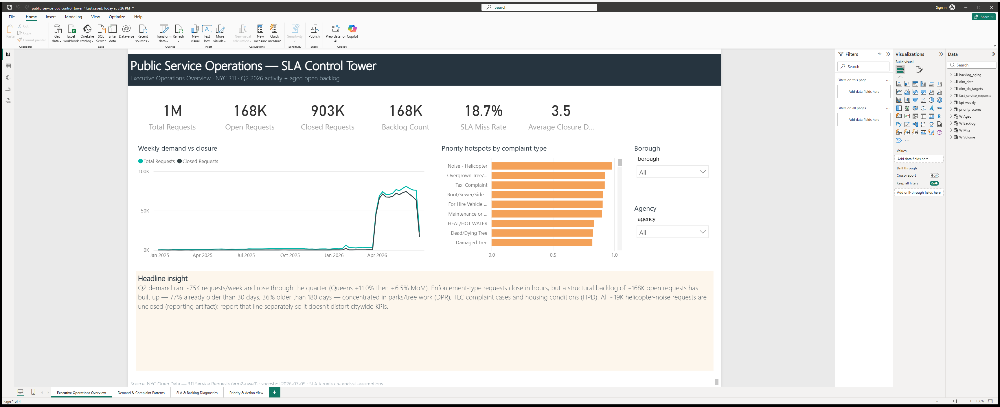

# Public Service Operations — SLA Control Tower

**An Excel + Power BI + SQL operations control tower** built on 1.07 million
real NYC 311 service requests: demand monitoring, closure performance, SLA
risk, backlog aging, and a transparent priority model that tells an
operations team where this week's attention should go.

> **The business problem.** A service operation fielding ~75,000 requests a
> week can't manage by anecdote. Leadership needs one recurring view of
> demand, closure performance, and what's silently aging in the backlog —
> and a defensible way to rank where to act first. This project builds that
> control tower with the tools most operations teams actually run on:
> Excel for the working model and assumptions, SQL for reproducible
> validation and KPI definitions, Power BI for the stakeholder dashboard.

**Data:** [NYC Open Data — 311 Service Requests](https://data.cityofnewyork.us/Social-Services/311-Service-Requests-from-2010-to-Present/erm2-nwe9)
(dataset `erm2-nwe9`): every request created Apr–Jun 2026 (968,993) plus all
older still-open requests back to Jan 2025 (101,825), snapshot 2026-07-05.
This is **public city service-request data, not private company operations
data** — staffing and true agency capacity are not in the dataset and are
never claimed. Full citation, field list and reproduction steps:
[data-sources.md](data-sources.md).

## Key findings (snapshot 2026-07-05)

| # | Finding | Number |
|---|---|---|
| 1 | Q2 request volume, and rising through the quarter (Queens +11.0% then +6.5% MoM) | **969K** (~75K/week) |
| 2 | Open backlog at snapshot | **~168K** requests |
| 3 | Share of open backlog already older than 30 / 180 days | **77% / 36%** |
| 4 | Citywide SLA miss rate vs assumed targets | **18.7%** |
| 5 | Worst high-volume SLA performers: Taxi Complaint, Root/Sewer/Sidewalk, Overgrown Tree/Branches | **99.6% / 99.5% / 88.5%** miss |
| 6 | NYPD share of Q2 demand — closed in hours (enforcement vs works-type demand is the operational fault line) | **48%**, 0.2-day avg closure |
| 7 | Helicopter-noise requests unclosed (reporting artifact, flagged not hidden) | **~19K, 100% open** |



## What's in the box

| Layer | Deliverable |
|---|---|
| **Excel** | [`excel/public_service_ops_control_tower.xlsx`](excel/public_service_ops_control_tower.xlsx) — 10 tabs: README, raw sample, 100K-row cleaned table with live formula columns, data dictionary, editable assumptions (SLA targets, aging buckets, priority weights), native pivot tables + pivot charts, SLA analysis, backlog analysis, priority model, action list. Zero formula errors; verified by full recalculation in Excel. |
| **SQL** | [`sql/`](sql) — DuckDB scripts: 9 data-quality checks, KPI views (the reference definitions), 10 analysis queries, priority scoring. [`sql/README.md`](sql/README.md) documents every definition. |
| **Power BI** | [`power-bi/public_service_ops_control_tower.pbix`](power-bi/public_service_ops_control_tower.pbix) — the working 4-page dashboard with the full 1.07M-row extract imported: executive KPIs, demand patterns, SLA/backlog diagnostics, and a priority matrix with what-if weight sliders. Authored as code (the PBIP semantic-model + report source is committed alongside), documented in [`power-bi/`](power-bi) with model docs, DAX reference, and real Desktop screenshots. |
| **Strategy** | [`reports/strategy_brief.md`](reports/strategy_brief.md) — findings, the priority model, a weekly/monthly operating rhythm, escalation criteria, limitations. |
| **Explainer** | [`explainer-guide/explain-it-to-me.md`](explainer-guide/explain-it-to-me.md) — the whole project for a non-technical reader, plus interview Q&A and a glossary. |

## How the three tools work together

**SQL is the source of truth** — every KPI (closure, SLA miss, aging,
priority score) is defined once in `sql/kpi_views.sql` against the full
1.07M-row extract. **Excel is the working model** — a 100K-row random sample
with the same definitions as live formulas, so every assumption (SLA
targets, weights, buckets) is editable and everything recalculates.
**Power BI is the stakeholder view** — the SQL exports load into a star
schema with what-if weight sliders on the priority model. Rates agree across
all three; volumes in Excel are labeled as sample-based with a scaling
factor.

## How to use it

**Just exploring?** Open the Excel workbook (start at its README tab), or
read the [strategy brief](reports/strategy_brief.md) and the
[dashboard mockups](power-bi/screenshots).

**Reproducing from scratch:**

```bash
pip install pandas pyarrow duckdb openpyxl requests   # pywin32 for the Excel pivot step
python scripts/pull_data.py        # ~10 min: pulls the 1.07M-row extract from NYC Open Data
python scripts/prepare_data.py     # typing + normalization + Excel sample
python scripts/run_sql.py          # DQ checks, KPI views, Power BI exports
python scripts/build_workbook.py   # workbook structure + formulas
python scripts/finalize_workbook.py  # pivot tables + recalc (needs desktop Excel on Windows)
```

**Opening the Power BI dashboard:** open
[`power-bi/public_service_ops_control_tower.pbix`](power-bi/public_service_ops_control_tower.pbix)
in the free Power BI Desktop — data is already imported. To rebuild from
scratch instead, follow
[`power-bi/manual_build_instructions.md`](power-bi/manual_build_instructions.md).

## Limitations (read before trusting the numbers)

- **No staffing/capacity data** — high backlog may mean under-resourcing,
  not negligence; this project never equates the two.
- **SLA targets are analyst assumptions**, reasoned and documented in
  [`data/assumptions/sla_targets.csv`](data/assumptions/sla_targets.csv),
  adjustable in one place. NYC publishes no per-type SLA in this dataset.
- **"Closed" is a recording fact, not verified resolution.** 1.9% of records
  have status/date disagreements — measured, documented (SQL check #04) and
  handled explicitly.
- **One quarter + inherited backlog** — winter-seasonal types (heat/hot
  water) are underrepresented; flagged wherever it matters.
- The Excel workbook runs on a labeled 100K random sample for file-size
  sanity; rates are unbiased, volumes carry a scaling factor, and
  full-population numbers come from SQL/Power BI.

## Portfolio Use

**CV bullets**

- Built an operations control tower (Excel + SQL + Power BI) over 1.07M NYC
  311 service requests — SLA tracking, backlog aging, and a weighted
  priority model that ranks complaint-type × borough hotspots for weekly
  ops review.
- Designed a reproducible DuckDB KPI layer (9 data-quality checks, 7 KPI
  views) used as the single source of definitions for both the Excel model
  and the Power BI dashboard.
- Delivered a 10-tab stakeholder Excel workbook — live COUNTIFS/SUMIFS
  logic, native pivot tables, editable SLA/weight assumptions, conditional
  formatting — verified to zero formula errors on a 100K-row table.

**LinkedIn project description**

> Public Service Operations SLA Control Tower — an Excel + Power BI + SQL
> project on 1.07M real NYC 311 service requests. DuckDB validates the data
> and defines the KPIs; a 10-tab Excel workbook holds the working model with
> editable SLA targets and priority weights; a 4-page Power BI dashboard
> (.pbix with the full extract imported) turns it into an executive view
> with what-if scenario weights. Key finding: 77% of the ~168K-request open
> backlog is already older than 30 days, concentrated in parks,
> taxi-complaint and housing workflows.

**Interview explanation (30 seconds, spoken)**

> "I built a control tower for service operations using NYC's 311 data — a
> million-plus real service requests. SQL does the data-quality checks and
> defines every KPI once; Excel holds the working model where the SLA
> targets and priority weights are editable assumptions; Power BI is the
> executive view. The punchline: the backlog problem isn't volume — 48% of
> demand closes in hours — it's aging concentrated in a handful of
> workflows, and the priority model points at exactly which ones."

**Likely interview questions (with answers)**

1. *"Your SLA targets are made up — doesn't that break the analysis?"*
   "They're assumptions, and I treat them that way: documented per type with
   a rationale, stored in one file, adjustable everywhere at once. The
   point of an SLA layer is decision support — it surfaces relative
   pressure. And when a target is missed 99% of the time, the insight isn't
   'missed SLA', it's 'this target is fiction — go agree a real one with
   the agency.' That's an operations finding in itself."
2. *"Why sample 100K rows in Excel when SQL has the full data?"*
   "File-size and responsiveness for the stakeholder who actually opens the
   workbook. A random sample keeps every rate unbiased; I label volumes as
   sample-based and provide a scaling factor, and the SQL layer computes
   the same KPIs on the full extract as the cross-check. The two agree to
   within a tenth of a percentage point on open share."
3. *"What would you do differently with internal data?"*
   "Three things: real agency SLA policies instead of assumed targets;
   staffing/capacity so backlog can be read as workload per resource, not
   raw counts; and resolution-quality signals — reopen rates, resident
   callbacks — because 'closed' in 311 is a recording fact, not proof the
   problem was fixed."

**How Excel, SQL and Power BI work together (one-liner)**

> "SQL is the reproducible validation and KPI layer, Excel holds the
> business model and every editable assumption, and Power BI turns the same
> definitions into a stakeholder-ready dashboard — one logic, three tools."

## Author

Shalom Wu ([@shalom-wu](https://github.com/shalom-wu)). Data: City of New
York, NYC Open Data (`erm2-nwe9`). MIT licensed.
